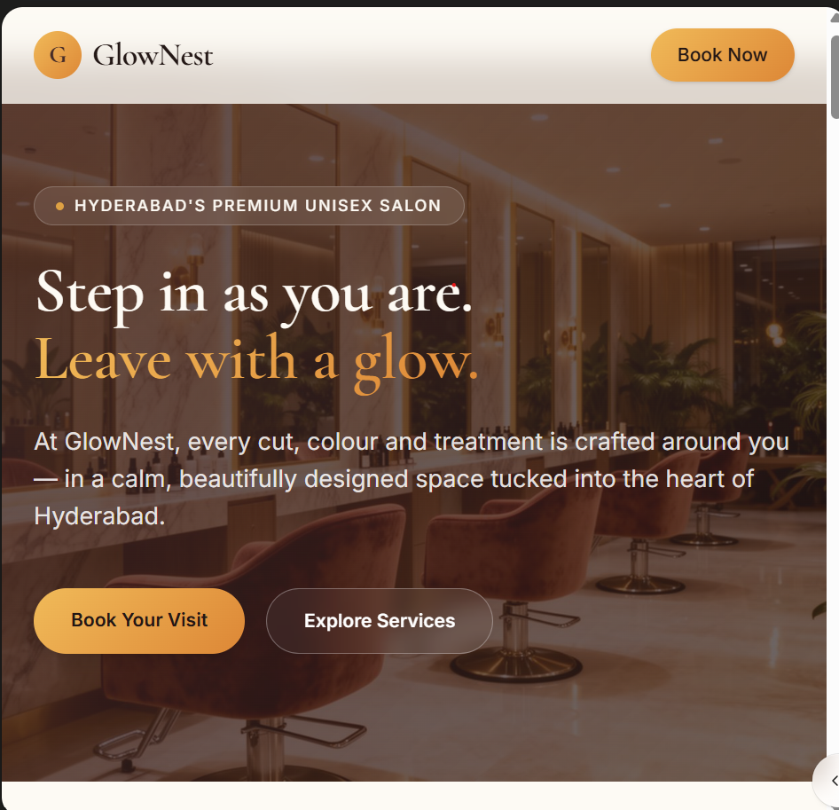
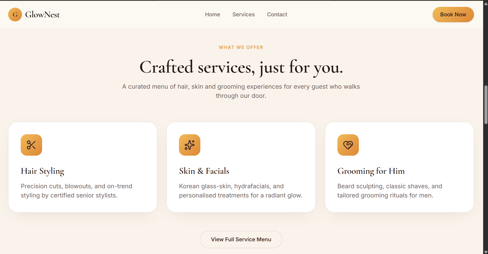
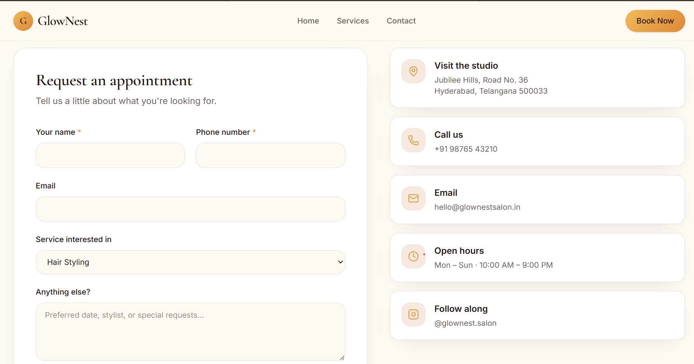

# AI Website Copy Generator for Local Businesses

## Project Overview

This project demonstrates how AI and Prompt Engineering can be used to create conversion-focused website copy for local businesses.

The goal is to help businesses improve website clarity, customer trust, and conversions using structured AI prompts.

---

## Business Chosen

### GlowNest Salon

Business Type:
Unisex Beauty Salon

Location:
Hyderabad

Target Customers:
- Working professionals
- Brides
- Students
- Families

Services:
- Hair Styling
- Hair Spa
- Hair Coloring
- Skincare
- Bridal Makeup
- Nail Care

---

## Problem

Many local businesses struggle with:

- unclear website messaging
- weak value propositions
- confusing calls-to-action
- generic website content

---

## Solution

Created a reusable AI prompt system that generates:

- Homepage copy
- Services page content
- CTA sections
- Business-specific website content

---

## Prompt Logic

The prompts are designed using:

- Business details
- Target audience
- Brand personality
- Customer benefits
- Conversion goals

This helps AI generate more relevant and human-like website content.

---

## Tools Used

- ChatGPT
- GitHub
- AI Website Builders

---
## Tone Adaptation

The prompt system can adjust writing style based on business category.

Examples:

- Salon → Friendly and premium
- Clinic → Professional and trustworthy
- Cafe → Warm and inviting
- Agency → Confident and expert

## Generated Content

This repository contains:

- Structured prompts
- AI generated website copy
- Documentation

---

## Outcome

The generated copy is ready to use for a real local business website and can help improve customer engagement and conversions.
## Website Demo Screenshots

### Homepage

### Services Page

### CTA Section

